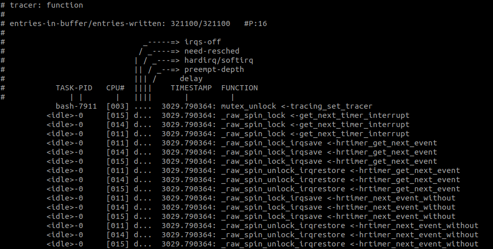
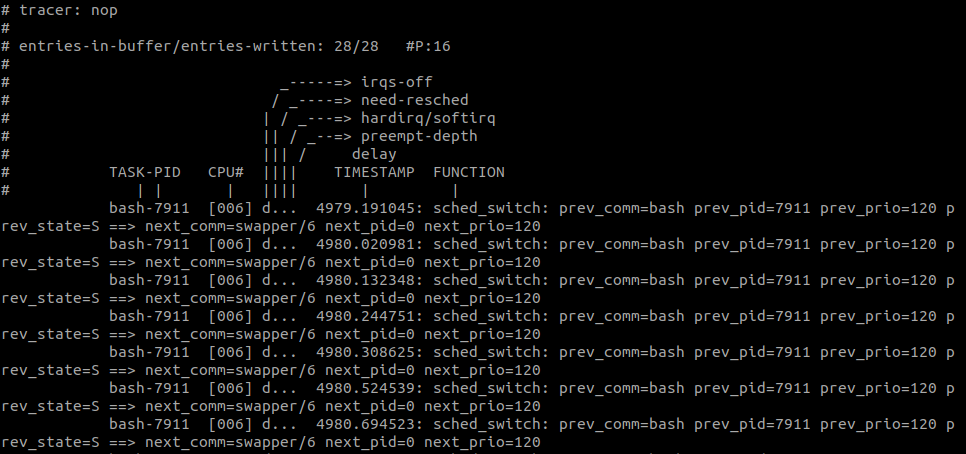
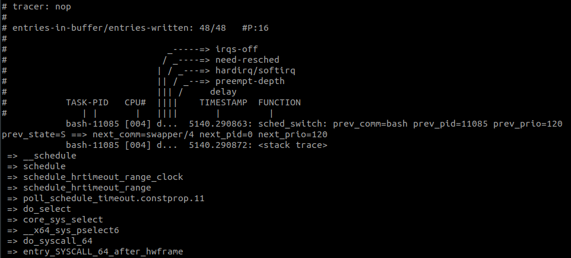
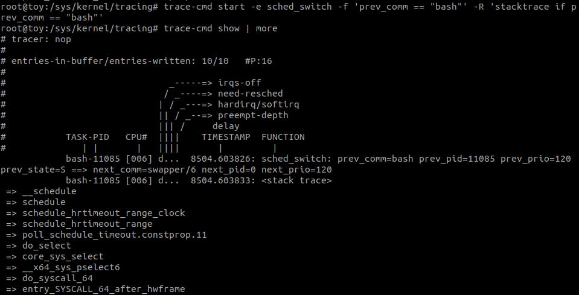

Ftrace의 기본적인 사용 방법과 Ftrace의 Front end tool인 trace-cmd와 Kernel Shark의 설치 및 사용 방법에 대한 포스트이다.

> 내 데스크탑 세팅 : 5.3.0-28-generic (Ubuntu18.04.4)

---

이 포스트는 [See what your computer is doing with Ftrace utilities](https://www.youtube.com/watch?v=68osT1soAPM) 영상을 보고 참고해서 작성하였습니다.

Ftrace의 maintainer인 [Steven Rostedt](https://blogs.vmware.com/opensource/author/srostedt/)는 현재 VMWare에 근무하는 듯하다. 그의 VMWare 홈페이지의 [포스트](https://blogs.vmware.com/opensource/2019/11/12/ftrace-linux-kernel/)에 ftrace관련 링크가 많이 포함되어 있으니 참고바랍니다.

---

# Ftrace
Ftrace는 Maintainer인 Steven Rostedt가 축복이라고 직접 말할만큼 커널 개발자에게 블랙박스인 커널 내부에서 어떤 함수들이 호출되는 지를 보여주는 중요한 도구이다.

대부분의 배포판들은 기본적으로 ftrace기능이 켜진 상태다. ```/sys/kernel/tracing```의 내용물을 확인해보자.
아무런 파일도 보이지 않는다면, 직접 마운트를 해주어야한다.

```
mount -t tracefs nodev /sys/kernel/tracing
cd /sys/kernel/tracing
ls
```

아래와 같이 마운트하게되면 자동으로 파일들이 생성된다.

> 이 아래부터는 현재 디렉토리가 /sys/kernel/tracing임을 가정한다.


---

### Tracer
트레이서는 (nop 제외) 4가지 종류가 있다.

* *nop* : 아무것도 하지 않는다. 트레이서를 끈것과 같다.

* *function* : 커널 함수들의 트레이스한다.

* *function_graph* : 커널 함수를 트레이스하고 그래프 형태로 보여준다.

* *blk* : blk 트레이서에서 사용한다.

* *mmiotrace* : driver와 hardware의 상호작용을 트레이스한다.

---

### trace
실제로 트레이스를 해보자. 기본적으로 tracing은 특정파일에 명령을 적는 식으로 동작하고 결과는 특정파일에서 읽어오는 방식으로 얻어온다. 즉, ```cat```과 ```echo```명령어만으로 조작할 수 있다.
(# 는 root에서 실행했음을 의미한다.)

```
// turn on function tracer
# echo function > current_tracer
# cat trace

// turn off function tracer
# echo nop > current_tracer
# cat trace
```
> cat trace | more 로 아래아 같은 화면을 볼 수 있다.

아래는 function tracer 실행화면이다.  ```cat trace | more```


<br>

### Tracing_on
tracing_on 이라는 파일은 tracer가 트레이스한 내용을 trace파일(버퍼)에 기록할 것 인지를 결정한다. 트레이싱은 하지만 기록은 안하는 상태이기 때문에 오버해드는 존재한다.

```
# echo function > current_tracer
# echo 0 > tracing_on
# cat trace
```

### Filter
cat trace는 너무 많은 함수콜을 보여주어서 읽기가 쉽지않다. trace를 할 함수와 제외할 함수를 선언해줄 수 있다.

```
# echo '*lock*' > set_ftrace_filter
# echo '*clock*' > set_ftrace_notrace
# echo function > current_tracer
# cat trace
```

아래 캡쳐와 같이 lock이 들어간 함수 중에 clock을 제외한 결과가 출력되었다.



<br>

아래 커맨드로 초기화 시켜준다.

```
# echo '' > set_ftrace_filter
# echo '' > set_ftrace_notrace
```

### Graph tracing
function tracer는 많은 정보를 알려주지만 보기는 사실 힘들다. tracer 종류로 function_graph를 사용하면 조금 더 보기 좋은 형태로 출력해준다.

```
# echo function_graph > current_tracer
# cat trace
```


<br>
위 화면을 보면 Duration이 있는데, 이 function_graph가 오버해드를 일으키기 때문에 정확한 시간 측정의 도구로는 사용하지말라고 한다. 


### Events
함수를 트레이싱하는 것은 좋지만, 함수가 불렸다는 정보외에 많은 정보를 주지 못한다. 그래서 추가적으로 Trace Events를 진행하면 더 자세한 정보들을 얻을 수 있다.
함수 말고도 시스템에서는 여러가지 이벤트들이 일어나고 있다. 예를 들면, sched(schedule events), irq(interrupt events), syscalls(system call events), module(module loading, unloading, ...)등이 있다.

```ls events``` 커맨드로 목록들을 확인 할 수 있다.

아래와 같이 ```enable``` 파일에 1을 적음으로써 해당 이벤트를 트레이싱할 수 있다. 2번째 줄은 sched 그룹의 sched_waking 이벤트만을 활성화 한 것이고, 3번째 줄은 sched 그룹의 모든 이벤트를 활성화 시킨 것이다.

```
# echo nop > current_tracer
# echo 1 > events/sched/sched_waking/enable
# echo 1 > events/sched/enable
# cat trace
```


<br>

### Event filter
```cat trace```로 잡아온 이벤트도 그 수가 너무 많다. 그 중에서 우리가 보고 싶은 녀석들만 잡아서 보기위해 또 다시 필터를 사용한다. 위의 사진에서 sched_switch이벤트 중에 ```prev_comm=bash```인 이벤트가 있다. 이러한 이벤트만 프린트 하고싶다면 아래와 같이 커맨드를 작성한다.

```
# echo 'prev_comm == "bash"' > events/sched/sched_switch/filter
# echo 1 > events/sched/sched_switch/enble
# echo > trace
# cat trace
```


<br>

### Event Trigger

필터와 비슷하게 특정 조건에서 발동하는 트리거를 설정할 수 있다. 예를 들어 위에서와 같이 ```prev_comm == "bash"``` 인 상황의 이벤트에서 stacktrace를 보려면 다음과 같이 커맨드를 작성한다.

```
# echo 'stacktrace if prev_comm == "bash"' > events/sched/sched_switch/trigger
# echo > trace
# cat trace
```


<br>

여기까지가 기본적인 ftrace 사용법이다. 따라하다보면 알겠지만, 인터페이스가 매우매우 간단하다. 사용한 명령어라고는 cat과 echo 뿐이다. 

이는 ftrace가 옛날에 만들어져 제한된 시스템에서도 사용할 수 있게 디자인 되었기 때문이다. 하지만 이 너무나도 단순한 인터페이스는 오히려 외워야 될 것이 많고 직관적이지도 않은 단점들을 야기했다.

ftrace의 maintainer는 ftrace를 위한 front-end 툴인 ftrace-cmd를 만들었다. 아래는 ftrace-cmd의 설치부터 간략한 사용방법에 대한 설명이다.

그 전에 해야할 것이 있다. 
* 먼저, *지긋지긋한 /sys/kernel/tracing 폴더에서 벗어나자.* 쓰기 권한이 있는 어디든 상관없다. root여도 되고 sudo user여도 된다.
* 두번째로는, *위에서 배운 내용들을 다 잊어버리자.*

---

# ftrace-cmd
Ftrace의 command line 프론트엔드인 ftrace-cmd를 설치하고 사용해보자. 
> ftrace의 maintainer이자 ftrace-cmd의 개발자인 Steven Rostedt는 ```ftrace-cmd``` 이름을 정말 잘못지었다고 후회하고 있다. 내가 봐도 조금 촌스럽긴하다.

설치방법은 [깃허브](https://github.com/rostedt/trace-cmd)에서 소스코드를 받아와 빌드하는 방법이 있고,

```
$ git clone https://github.com/rostedt/trace-cmd.git
$ cd trace-cmd
$ make
$ make install
```

Ubuntu기준으로는 저장소에서 다운로드 받을 수 있다.
```
$ apt install trace-cmd
```

### trace-cmd start and show
사용하는 방법은 아주 간단하다. 위의 trace-cmd를 사용하지 않고 했었던 것을 그대로 하면 다음과 같다.

```
# trace-cmd start -e sched_switch -f 'prev_comm == "bash"' -R 'stacktrace if prev_comm == "bash"'
# trace-cmd show
```

파일에 일일이 커맨드를 적어주지 않고, /sys/kernel/tracing 폴더로 옮겨가지 않고, 아까 얻었던 결과와 동일한 결과를 얻어낼 수 있다.


<br>

### trace-cmd stat and reset
Ftrace를 사용하면서 내가 무슨 설정을 켰었지? 하는 경우가 있다. 무슨 트리거를 설정했는지, 무슨 필터를 적용했는지 기억하면서 초기화해주는 것이 너무 불편했다.

trace-cmd를 사용하면 stat 명령어로 확인할 수 있고, reset 명령어로 초기화 할 수 있다.

```
# trace-cmd stat

Events:
 Individual events:
    sched
        sched_switch

Filters:
  sched:sched_switch "(prev_comm == "bash")"

Triggers:
  sched:sched_switch "stacktrace:unlimited if prev_comm == "bash""

Function No Trace:
   clocksource_arch_init
   update_persistent_clock64

# trace-cmd reset

Events:
  All disabled

```


### trace-cmd record and report
사실 start, show와 거의 다를바없다. record는 대신 내용을 저장하고, report는 그것을 보여준다.


---

# KernelShark
커널 샤크는 ftrace의 GUI 버전 프론트엔드라고 보면된다.

설치방법은 아래와 같다. 

prerequisite을 먼저 깔아준다.

```
$ sudo apt install swig python-dev
```

[홈페이지](https://kernelshark.org/)에서 압축파일을 다운로드받아 설치한다.
```
$ wget https://git.kernel.org/pub/scm/utils/trace-cmd/trace-cmd.git/snapshot/trace-cmd-kernelshark-v1.1.tar.gz
$ tar xvzf trace-cmd-kernelshark-v1.0.tar.gz
$ cd trace-cmd-<Tab>
$ make gui
$ make install_gui
```
